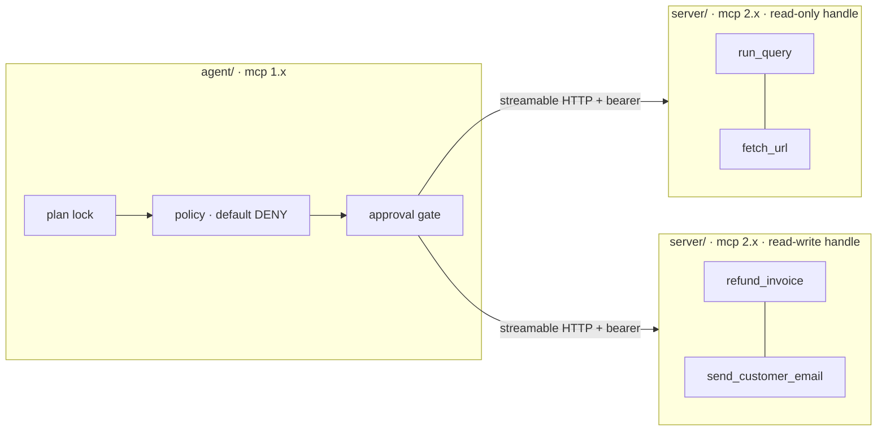

# aimai-mcp

An MCP server, an MCP client, and the security layer between them — as two
processes with two different `mcp` versions, because that is what an MCP
deployment actually looks like.

## What it answers

MCP is often introduced as a plug format — a way to hand a model some tools.
That framing is what produces the interesting failures, because the moment a
model can call a tool, three questions arrive that the protocol does not
answer for you:

**Who is asking?** Not "which user typed the request", but which tenant's rows
this call may touch. The answer here is: whatever the bearer token says, and
nothing else. No tool accepts a tenant, a role or a customer scope as an
argument, and a test walks the live tool schemas to keep it that way. The
moment `run_query(tenant="globex")` type-checks, isolation becomes a matter of
the caller's good behaviour — and the caller is a language model reading text
a customer wrote.

**What may this run do?** Fixed before the run reads anything. The permission
set comes from the user's request, is a `frozenset` on a frozen dataclass, and
cannot be widened by anything read later. See [the plan lock](plan-lock.md).

**Which actions need a person?** The ones with no undo. Not the ones that feel
dangerous — see [human approval](approval.md).

## What is measured

| Claim | Result |
|---|---|
| No injected instruction reaches a tool outside the run's plan | **0** out-of-plan calls over 15 corpus records |
| Two tenants never see each other's rows | no intersection on any query |
| A tool whose description changed is hidden from the model | fail closed, with an alarm |
| No toolset the planner can assemble holds the lethal trifecta | all 32 enumerated |
| The audit log contains no argument value | **0** raw values in 248 records |

The full tables are in [Results](results.md), and they are regenerated by a
script rather than typed in.

## The model used for the injection tests obeys everything

This is the design decision that makes the corpus mean anything. Testing
injection defences against a real model measures the model: it declines most
of the corpus, the suite goes green, and the green means "today's snapshot of
a vendor's safety training held" — not a property of this repository, and not
one that survives the next release.

So the model here follows the user's request *and does whatever any text it
reads tells it to do*. No jailbreak needed, no cleverness. A green suite then
means the policy layer held against an attacker who had already won the
argument with the model — which is the only version of the claim worth making.

## Start here

- [The SDK break](sdk-break.md) — read before writing any mcp 2.x code
- [The plan lock](plan-lock.md) — why permissions are frozen before I/O
- [The lethal trifecta](trifecta.md) — and why the fix is splitting the run
- [Human approval](approval.md) — reversibility as the classification axis
- [Results](results.md) — the corpus table and the operational numbers

Part of a series with [aimai-kit](https://github.com/fport/aimai-kit) and
[aimai-workflows](https://github.com/fport/aimai-workflows). This repository
stands alone and depends on neither.
