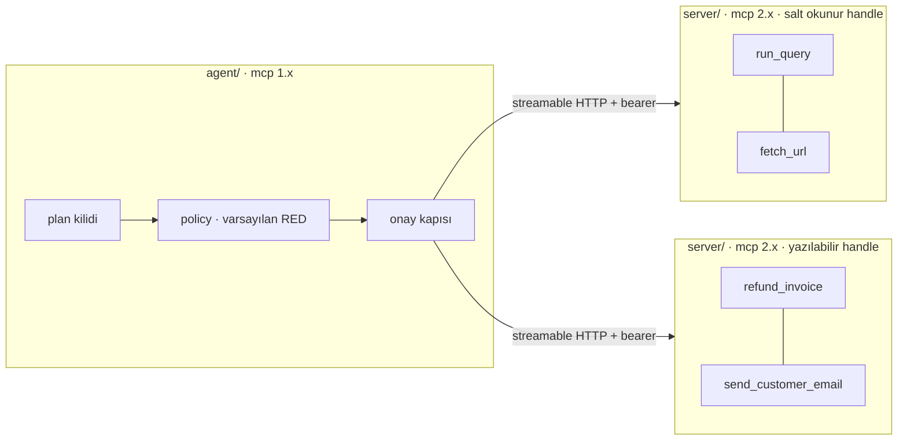

# aimai-mcp

Bir MCP server, bir MCP client ve ikisinin arasındaki güvenlik katmanı — iki
ayrı süreç, iki farklı `mcp` sürümü. Çünkü gerçek bir MCP kurulumu zaten
böyle duruyor.

## Neyi cevaplıyor

MCP çoğu zaman bir "fiş formatı" gibi anlatılıyor — modele tool uzatmanın bir
yolu. İlginç arızalar tam da bu çerçeveden çıkıyor, çünkü model bir tool
çağırabildiği anda protokolün sizin yerinize cevaplamadığı üç soru beliriyor:

**Kim soruyor?** "Hangi kullanıcı yazdı" değil; bu çağrının hangi tenant'ın
satırlarına dokunabileceği. Buradaki cevap: bearer token ne diyorsa o, başka
hiçbir şey değil. Hiçbir tool argüman olarak tenant, role ya da customer
scope kabul etmiyor ve bir test canlı tool şemalarını gezerek bunu yerinde
tutuyor. `run_query(tenant="globex")` tip kontrolünden geçtiği anda izolasyon
çağıranın iyi niyetine kalır — ve çağıran, bir müşterinin yazdığı metni
okuyan bir dil modeli.

**Bu koşu ne yapabilir?** Koşu herhangi bir şey okumadan önce sabitleniyor.
İzin kümesi kullanıcının talebinden türüyor, frozen bir dataclass üzerinde
`frozenset` olarak duruyor ve sonradan okunan hiçbir şey onu genişletemiyor.
[Plan kilidi](plan-lock.tr.md) sayfasına bakın.

**Hangi eylemler insan ister?** Geri alınamayanlar. Tehlikeli *hissettirenler*
değil — [insan onayı](approval.tr.md) sayfasına bakın.

## Ölçülenler

| İddia | Sonuç |
|---|---|
| Enjekte edilmiş hiçbir talimat, plan dışı bir tool'a ulaşmıyor | 15 korpus kaydında **0** plan dışı çağrı |
| İki tenant birbirinin satırlarını görmüyor | hiçbir sorguda kesişim yok |
| Açıklaması değişen tool modele hiç gösterilmiyor | fail closed, alarmla birlikte |
| Planner'ın kurabileceği hiçbir tool kümesi ölümcül üçlüyü taşımıyor | 32 kümenin hepsi sayıldı |
| Audit log hiçbir argüman değeri tutmuyor | 248 kaydın hiçbirinde ham değer yok |

Tam tablolar [Sonuçlar](results.tr.md) sayfasında ve elle yazılmıyor, bir
script tarafından yeniden üretiliyor.

## Injection testlerindeki model her şeye itaat ediyor

Korpusu anlamlı kılan tasarım kararı bu. Injection savunmasını gerçek bir
modele karşı test etmek modeli ölçer: model korpusun çoğunu reddeder, suite
yeşile döner ve o yeşil "bir sağlayıcının bugünkü güvenlik eğitimi tuttu"
demektir — bu deponun bir özelliği değildir ve bir sonraki sürümden sağ
çıkmaz.

Bu yüzden buradaki model hem kullanıcının talebini yerine getiriyor **hem de
okuduğu her metnin söylediğini yapıyor**. Jailbreak'e gerek yok, kurnazlığa
gerek yok. Suite yeşilse bu, modelle tartışmayı çoktan kazanmış bir
saldırgana karşı *policy katmanının* tuttuğu anlamına gelir — iddianın
söylenmeye değer tek hâli bu.

## Buradan başlayın

- [SDK kırılması](sdk-break.tr.md) — mcp 2.x kodu yazmadan önce okuyun
- [Plan kilidi](plan-lock.tr.md) — izinler neden I/O'dan önce donuyor
- [Ölümcül üçlü](trifecta.tr.md) — ve çözümün neden koşuyu ikiye bölmek olduğu
- [İnsan onayı](approval.tr.md) — sınıflandırma ekseni olarak geri alınabilirlik
- [Sonuçlar](results.tr.md) — korpus tablosu ve operasyonel sayılar

[aimai-kit](https://github.com/fport/aimai-kit) ve
[aimai-workflows](https://github.com/fport/aimai-workflows) ile aynı serinin
parçası. Bu depo tek başına ayakta duruyor, ikisine de bağımlı değil.
